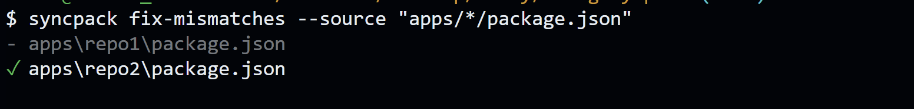

# Synpack

Syncpack helps you find and fix inconsistencies between every dependency defined throughout your monorepo's package.json files.

## Synpack Github Action

Link: https://jamiemason.github.io/syncpack/github-action

## Configuration File

This is **optional**.

You can declare either:

- `syncpack` property in `package.json`
- `.syncpackrc` file in JSON or YAML format
- `.syncpackrc.json`, `.syncpackrc.yaml`, `.syncpackrc.yml`, `.syncpackrc.js`, or `.syncpackrc.cjs` file
- `syncpack.config.js` or `syncpack.config.cjs` CommonJS module exporting an object
- `config.syncpack` property in package.json

Default configuration is

```json
{
  "customTypes": [],
  "dependencyTypes": [
    "dev",
    "overrides",
    "peer",
    "pnpmOverrides",
    "prod",
    "resolutions",
    "workspace"
  ],
  "filter": ".",
  "indent": "  ",
  "semverGroups": [],
  "semverRange": "",
  "sortAz": [
    "contributors",
    "dependencies",
    "devDependencies",
    "keywords",
    "peerDependencies",
    "resolutions",
    "scripts"
  ],
  "sortFirst": ["name", "description", "version", "author"],
  "source": ["package.json", "packages/*/package.json"],
  "versionGroups": []
}
```

Key configuration we need to look at are as follow

### filter

A string which will be passed to new RegExp() to match against package names that should be included.

### source

Patterns supported by glob to find package.json files you want to manage with syncpack.

```json
{
  "source": ["package.json", "packages/*/package.json"]
}
```

### versionGroups

Allows you to manage packages along with dependencies.

`versionGroups` expects an array of object that has the following key-value pairs.

#### `packages` string[]

This is a required field.

An array of strings which should match the name properties of your `package.json` files. This is used in combination with the dependencies property to determine which dependencies should belong to this version group.

The strings can any combination of exact matches or minimatch glob patterns:

```
// match any package
["**"]

// match any package with a certain scope
["@my-repo/**"]

// match specific packages by name
[("my-server", "my-client")];
```

#### `dependencies` string[]

This is a required field.

An array of strings which should match the names of dependencies you've installed or otherwise referenced in your package.json files. This is used in combination with the packages property to determine which dependencies should belong to this version group.

```
// match any dependency
["**"]

// match all dependencies with a certain scope
["@aws-sdk/**"]

// match specific dependencies by name
["react", "react-dom"]
```

Others are all optional fields. The docs of this can be found on this [link](https://jamiemason.github.io/syncpack/config/version-groups)

## CLI Examples

Fix mismatches

App 1

```json
{
  "dependencies": {
    "lodash": "^4.17.21",
    "next": "^13.4.1",
    "next-connect": "^1.0.0",
    "typescript": "^5.0.4"
  }
}
```

App 2

```json
{
  "dependencies": {
    "lodash": "^3.0.1",
    "next": "^12.0.1",
    "typescript": "^4.1.6"
  }
}
```

#### Listing mismatching dependencies

```bash
syncpack list --source "apps/*/package.json"
```

.png>)

#### Auto fixing mismatching dependencies

```bash
syncpack fix-mismatches --source "apps/*/package.json"
```



We see that the `package.json` in the repo1 had no changes since they were all upto date. However, the `package.json` in the repo2 was all updated.

`package.json` from repo2

```json
{
  "dependencies": {
    "lodash": "^4.17.21",
    "next": "^13.4.1",
    "typescript": "^5.0.4"
  }
}
```

## Pros

- It is great for the mono-repo. Allows you to manage all of the packages in sync.
- Gets done using CLI and allows you to watch/ignore dependencies of your choice.

## Cons

- Syncpack doesn't have the ability to udpate `package-lock.json` file.
- Unlike dependabots, it doesn't let you know if there are newly available versions and what was the critical problem.
- Limited to npm packages
